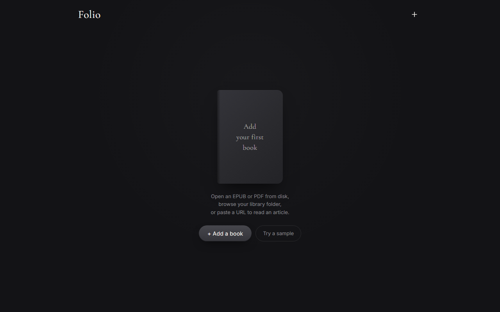

# folio

Minimalist desktop reader for EPUBs, PDFs, and web articles. Opens a quiet single-column reading view; serves files from a local library folder; remembers progress.



## Running

Windows (double-click):

```
Folio.bat
```

This starts a small Python server (`server.py`) and opens the browser to the reader UI.

Manually:

```bash
python server.py
# then open http://localhost:<port> shown in the terminal
```

## What you can do

- **Add a book** — pick an EPUB or PDF from disk, or paste a URL to read an article.
- **Try a sample** — loads a bundled test fixture so you can see the layout without supplying your own content.
- Open `index.html` in a browser if you just want to test the front-end without the server.

## Layout

```
index.html                  reader UI
app.js                      reader behaviour
styles.css                  reader styling
server.py                   local file server (library access + URL fetch)
Folio.bat                   Windows double-click runner
setup-desktop-shortcut.ps1  installs a Desktop shortcut + .ico
test-fixtures/              sample content for "Try a sample"
make_test_cbz.py            helper to build a test CBZ
extract-naruto.ps1          one-off ingestion script
```
